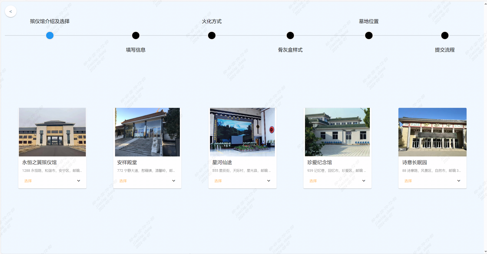
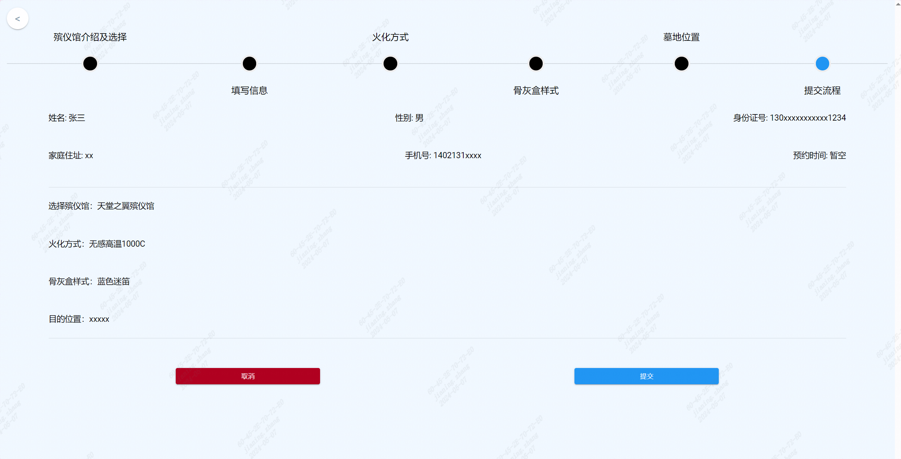
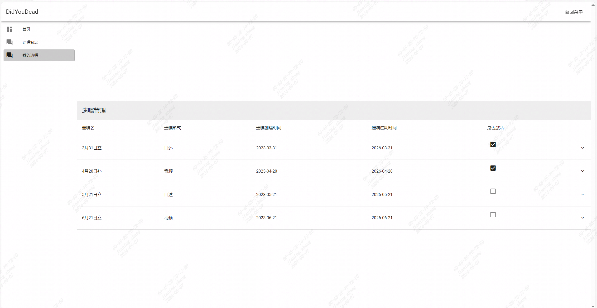
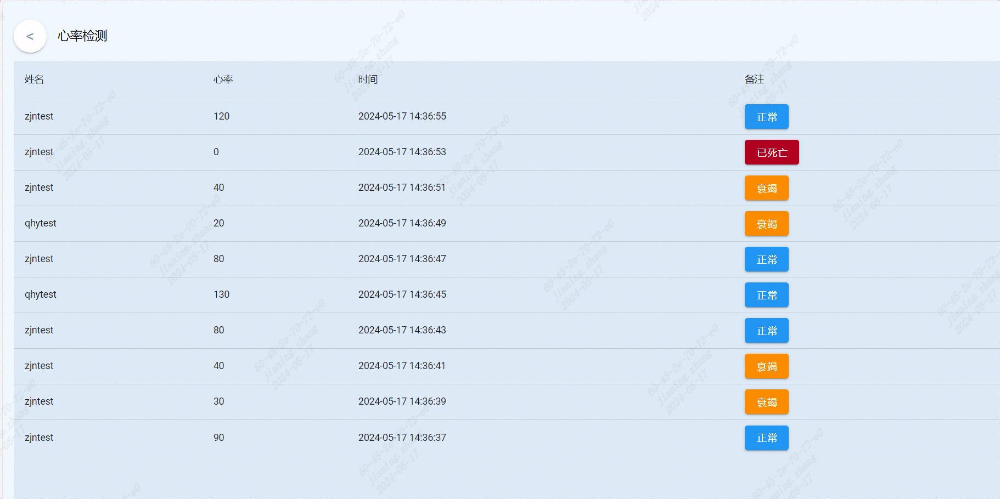

# DidYouDead
[死了吗？基于Go语言实现的死亡托管服务]
- 是否还在为死亡无人负责所烦恼？
- 是否还在害怕烂在家里无人问津?
## 开发 SI了吗 项目！为你的身体找个归宿！
- 死了吗？专注于检测死亡、死亡后业务等诸多环节
## 功能介绍
- 殡仪馆选择及火化功能
- 遗嘱制定功能
- 遗嘱存储功能
- 智能技术功能
- 心率检测功能


# 技术栈
- 前端：js + less + Vue3 + Vue-Router + Pinia
- 后端：go + Gin + MySQL

# 环境
- node.js 20
- go 1.21.6
# 启动方式
```bash
# 前端启动方式
cd DidYouDead/fronted/dydfront
npm install
npm run dev

# 后端启动方式
cd DidYouDead/backend
go run main.go
```

# 功能展示
## 首页
 
## 殡仪馆及火化服务
 
 
## 智能技术服务
 
## 遗嘱存储服务
 
 
## 心率检测服务
 


<!-- PS：内部提供一个可用的公网Mysql用于测试，如果被攻击会停止，由于mysql中无任何有用数据，所以不怕被敲诈 -->